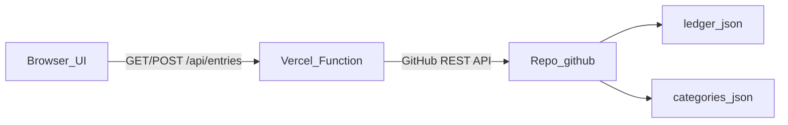

# Gastos — ciclo 10 → 9 + ledger no GitHub

Interface estática para lançar gastos no estilo WhatsApp (`Descrição- 35,93`), classificar por categoria e ver totais por **ciclo mensal** (dia **10** ao **9** do mês seguinte). Os lançamentos são gravados em **`data/ledger.json`** no repositório GitHub via **API serverless (Vercel)** — o token fica só no servidor.

## Arquitetura



- **Frontend**: `index.html`, `app.js`, `styles.css` — pode ficar no **mesmo projeto Vercel** ou em **GitHub Pages** apontando para a URL da API.
- **Backend**: [`api/entries.js`](api/entries.js) — lê/grava o ledger com concorrência otimista (`sha`) e retry em conflito.
- **Ledger**: [`data/ledger.json`](data/ledger.json) — lista única `entries`; cada item tem `id`, `date`, `description`, `amount`, `category`, `cycleKey`, `tags` (opcional).
- **Categorias (servidor)**: o endpoint lê [`categories.json`](categories.json) do **mesmo repositório** ao salvar, para a categoria bater com o que está versionado.

## Variáveis de ambiente (Vercel)

Copie de [`.env.example`](.env.example):

| Variável | Obrigatório | Descrição |
|----------|-------------|-----------|
| `GITHUB_TOKEN` | Sim | PAT ou fine-grained token com **Contents: Read and write** no repo alvo |
| `GITHUB_OWNER` | Sim | dono do repositório (usuário ou org) |
| `GITHUB_REPO` | Sim | nome do repositório |
| `LEDGER_PATH` | Não | Caminho do arquivo no repo (padrão: `data/ledger.json`) |
| `ALLOWED_ORIGINS` | Não | Origens CORS separadas por vírgula (ex.: `https://seu-usuario.github.io`). Se vazio, usa `*` |

## Deploy (recomendado: Vercel para UI + API)

1. Conecte o repositório à Vercel.
2. Configure as env vars acima (Project → Settings → Environment Variables).
3. Faça deploy da **raiz** do projeto (Vercel detecta `/api`).
4. Abra a URL de produção: o front usará `/api/entries` no mesmo domínio.

### GitHub Pages + API na Vercel

1. Faça deploy só do front no Pages **ou** use o mesmo repo com Pages em branch/pasta estática.
2. No `index.html`, antes de carregar `app.js`, defina a base da API:

```html
<script>
  window.__EXPENSE_API_BASE__ = "https://seu-projeto.vercel.app";
</script>
```

3. Em Vercel, defina `ALLOWED_ORIGINS` com a URL exata do GitHub Pages (ex.: `https://usuario.github.io`).

## Uso do app

1. Digite, por exemplo: `Uber- 35,93` ou **cole uma conversa** exportada do WhatsApp (várias linhas).
2. **Adicionar** envia `POST /api/entries` com `{ "line": "..." }` (uma linha) ou `{ "bulk": "..." }` (cola); o servidor atualiza `ledger.json` (um commit por envio; em bulk, vários lançamentos no mesmo commit).
3. **Abas de ciclo**: cada aba é um `cycleKey` (`YYYY-MM`); a tabela mostra totais por categoria, a linha **Simone (marcados)** (soma do ciclo para despesas etiquetadas) e o **total geral** do ciclo.
4. **Exportar CSV** baixa os lançamentos do ciclo selecionado (inclui coluna `tags`).

### Importação em massa (WhatsApp)

- O campo aceita **várias linhas**. O front envia como `bulk` se houver quebra de linha, se o texto parecer exportação WhatsApp (`[DD/MM/AA, HH:MM:SS] Nome: …`), ou se for muito longo (> 400 caracteres).
- Linhas com carimbo `[ … ] Nome:` definem **data/hora** do lançamento (interpretado como horário de Brasília). Linhas seguintes **sem** carimbo usam o último horário visto (ex.: `Glucerma- 175, 77` logo após `Supermercado- 181, 54`).
- **Ruído** (URLs, “Read more”, respostas curtas, instruções em inglês no início, etc.) é ignorado; a resposta da API inclui quantas linhas foram **ignoradas**.
- **`Cancelado`**: remove o lançamento mais recente cujo nome casar com **`/[magn][eé]sio/i`** (troca de pedido de magnésio); se não houver, remove o **último** lançamento da lista (heurística — revise conversas ambíguas).
- Limites: ~120 mil caracteres por cola; até ~500 lançamentos extraídos por requisição.

### Tag Simone

- Se a **descrição** contiver **`simone`** em qualquer capitalização (`Simone`, `SIMONE`, etc.), o lançamento recebe `tags: ["Simone"]` no ledger.
- No **GET**, entradas antigas sem `tags` recebem a etiqueta automaticamente se a descrição casar com a regra.
- O subtotal **Simone (marcados)** na tabela é sempre para o **mesmo ciclo** selecionado nas abas (período 10 → 9).

### Tag Cartao Sergio

- Se a descrição contiver **`cartao sergio`** (aceitando maiúsculas/minúsculas e acentos como `cartão sérgio` ou `cartäo sergio`), o lançamento recebe a tag `Cartao Sergio`.
- A detecção é feita no servidor (mesma lógica das demais tags).

### Formato da linha

- O **último** `-` separa descrição e valor (ex.: `Nome longo - item- 12,50`).
- Valor: vírgula ou ponto decimal.

### Regra do `cycleKey`

- Dia do lançamento **≥ 10**: ciclo = mês corrente.
- Dia **≤ 9**: ciclo = mês **anterior**.

### Modelo de um lançamento (`ledger.json`)

| Campo | Descrição |
|-------|-----------|
| `id` | UUID |
| `date` | ISO 8601 |
| `description` | Nome do gasto |
| `amount` | Número (BRL) |
| `category` | Categoria (resolvida no servidor) |
| `cycleKey` | `YYYY-MM` do início do ciclo |
| `tags` | Lista opcional de etiquetas; ex.: `["Simone"]` quando a descrição contém `simone` (case-insensitive) |

Entradas antigas com `createdAt` em vez de `date` ainda são aceitas no `GET` (normalização no servidor).

## Teste local da API

```bash
cp .env.example .env.local
# Preencha GITHUB_TOKEN, GITHUB_OWNER, GITHUB_REPO

npx vercel dev
```

Abra a URL que o CLI mostrar (ex.: `http://localhost:3000`). O front e `/api/entries` respondem no mesmo host.

## Arquivos principais

- [`index.html`](index.html) — UI + `window.__EXPENSE_API_BASE__`
- [`app.js`](app.js) — chamadas à API, abas de ciclo, consolidação, CSV
- [`api/entries.js`](api/entries.js) — `GET`/`POST` + GitHub
- [`lib/github-ledger.js`](lib/github-ledger.js) — leitura/escrita do arquivo no repo
- [`lib/cycle.js`](lib/cycle.js), [`lib/parse-line.js`](lib/parse-line.js), [`lib/categorize.js`](lib/categorize.js), [`lib/tags.js`](lib/tags.js), [`lib/whatsapp-bulk.js`](lib/whatsapp-bulk.js) — lógica no servidor
- [`data/ledger.json`](data/ledger.json) — ledger inicial (pode evoluir com commits da API)

## Segurança

- Nunca coloque `GITHUB_TOKEN` no front ou em repositório público sem proteção.
- Restrinja o token ao repositório mínimo necessário.
- Em produção, prefira `ALLOWED_ORIGINS` explícito em vez de `*`.
